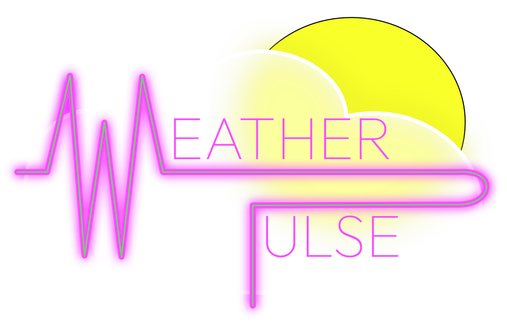
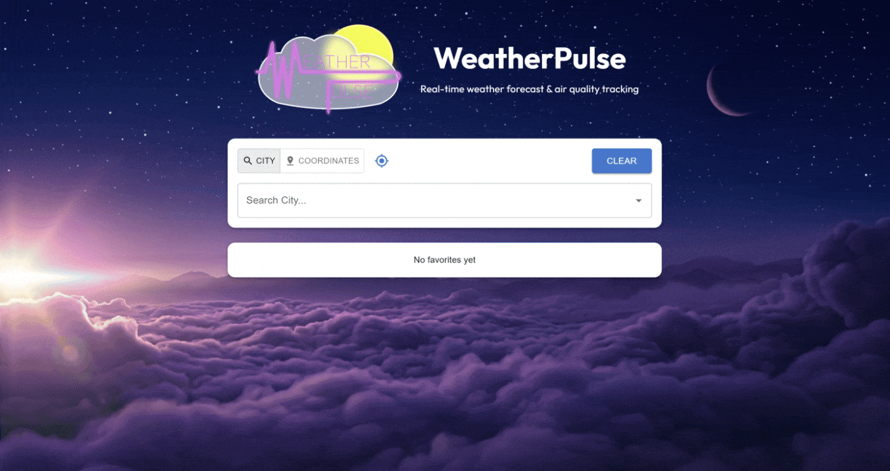

<div align="center">
  

  # WeatherPulse

  **Real-time weather forecast & air quality tracking**

  
  
  
  
  
  

  <br />

  
</div>

---

## Table of Contents

- [About the Project](#about-the-project)
- [Tech Stack](#tech-stack)
- [Key Features](#key-features)
- [Project Structure](#project-structure)
- [Getting Started](#getting-started)
- [Technical Highlights](#technical-highlights)
- [Lessons Learned](#lessons-learned)
- [Future Improvements](#future-improvements)
- [License](#license)

---

## About the Project

WeatherPulse is a responsive single-page weather app built with React and TypeScript. I built it as an assignment for my Software Development Bootcamp. You can look up any city in the world, either by name, by coordinates or from your own location. The app then shows:

- the **current conditions** (temperature, "feels like", description, local date & time)
- a **24-hour temperature trend** chart
- a **4-day forecast**
- **humidity, wind speed and air quality** (converted to the US EPA AQI scale)

The whole UI changes its look to match the weather. Each condition (clear day, clear night, rain, snow, thunderstorm, etc.) has its own gradient and icon set. Cards animate in smoothly, and you can save up to three cities as favorites so they're one click away next time.

All weather data comes from the [OpenWeatherMap API](https://openweathermap.org/api).

---

## Tech Stack

### Core

| Technology | Purpose |
| --- | --- |
| [React 19](https://react.dev/) | UI library (function components + custom hooks) |
| [TypeScript](https://www.typescriptlang.org/) | Static typing across components, hooks, API responses and utils |
| [Vite](https://vite.dev/) | Dev server and production bundler |

### External Libraries

| Library | Purpose |
| --- | --- |
| [Material UI (MUI)](https://mui.com/) + [Emotion](https://emotion.sh/) | Component library (Autocomplete, Cards, Chips, Snackbar, Skeleton…) and the `sx` styling system |
| [MUI Icons](https://mui.com/material-ui/material-icons/) | UI icons (search, location, favorites star, humidity, wind…) |
| [Recharts](https://recharts.org/) | 24-hour temperature trend area chart |
| [Motion](https://motion.dev/) (formerly Framer Motion) | Entry/exit animations, staggered cards, animated unit changes |

### APIs

| API | Used for |
| --- | --- |
| OpenWeatherMap **Current Weather** (`/data/2.5/weather`) | Current conditions |
| OpenWeatherMap **5 Day / 3 Hour Forecast** (`/data/2.5/forecast`) | Hourly trend + daily forecast |
| OpenWeatherMap **Air Pollution** (`/data/2.5/air_pollution`) | PM2.5 concentration → AQI |
| OpenWeatherMap **Geocoding** (`/geo/1.0/direct` & `/reverse`) | City search & coordinates → city name |
| Browser **Geolocation API** | "Use my location" button |

### Testing & Tooling

| Tool | Purpose |
| --- | --- |
| [Vitest](https://vitest.dev/) + [jsdom](https://github.com/jsdom/jsdom) | Test runner and browser environment |
| [React Testing Library](https://testing-library.com/docs/react-testing-library/intro/) + `user-event` + `jest-dom` | Component, hook and integration tests |
| [ESLint](https://eslint.org/) + `typescript-eslint` + React Hooks plugin | Linting |

---

## Key Features

- 🔍 **City search with autocomplete.** Results show up as you type. They're debounced, deduplicated, and show the state/region and full country name.
- 📍 **Search by coordinates.** Enter a latitude/longitude pair (validated against -90…90 / -180…180). The app reverse-geocodes it to a city name and falls back to a coordinate label if nothing is found.
- 🧭 **Use my location.** One click uses the browser's Geolocation API to get the weather where you are.
- 🌡️ **Current weather card.** Temperature, "feels like", description and the city's **local** date & time, adjusted for its time zone.
- 📈 **24-hour temperature trend.** An interactive area chart. Its tooltip shows temperature, feels like, chance of rain and conditions.
- 📅 **4-day forecast.** Daily highs/lows built from the 3-hour forecast data.
- 💧 **Weather metrics.** Humidity, wind speed and an **air quality badge** (US EPA AQI, color-coded from *Good* to *Hazardous*).
- ⭐ **Favorites.** Save up to 3 cities. They are kept in `localStorage` and stay in sync across browser tabs.
- 🔁 **°C / °F toggle.** Switch units at any time. The data is fetched again in the new unit and the values animate as they change.
- 🎨 **Dynamic weather themes.** Gradients and icons change with the condition and with day or night.
- ✨ **Animations.** Fade/slide entry animations, staggered cards and chip exit animations. The app respects the OS "reduce motion" setting.
- ⏳ **Loading skeletons & error toasts.** A skeleton layout shows while data loads. Readable messages appear for API errors, rate limits, timeouts and denied location permissions.
- 📱 **Responsive.** Layout adapts from mobile to desktop.

---

## Project Structure

```text
weatherpulse/
├── docs/
│   └── weatherpulse-demo.gif       # Demo animation used in this README
├── public/
│   └── favicon.png
├── src/
│   ├── assets/
│   │   ├── icons/                  # Weather condition icons (clear-day, rain, snow, tornado…)
│   │   ├── weather-pulse-bg.jpg    # App background image
│   │   └── weather-pulse-logo.png
│   │
│   ├── components/                 # Presentational React components
│   │   ├── SearchBar.tsx           # City autocomplete / coordinates form / "my location" button
│   │   ├── FavoritesBar.tsx        # Favorite city chips (animated add/remove)
│   │   ├── WeatherPanel.tsx        # Lays out all weather cards for the selected city
│   │   ├── WeatherPanelSkeleton.tsx# Loading placeholder for the panel
│   │   ├── WeatherHeaderBar.tsx    # Favorite toggle + °C/°F switch
│   │   ├── CurrentWeatherCard.tsx  # Current temp, feels like, local date & time
│   │   ├── TemperatureTrendsCard.tsx # Recharts 24h temperature chart
│   │   ├── ForecastCard.tsx        # 4-day forecast
│   │   ├── WeatherMetricsCard.tsx  # Humidity, wind, air quality badge
│   │   ├── NotificationToast.tsx   # Snackbar error / warning toasts
│   │   ├── AnimatedText.tsx        # Animated value changes (e.g. unit toggle)
│   │   └── __tests__/
│   │
│   ├── hooks/                      # Custom hooks: all stateful logic lives here
│   │   ├── useWeather.ts           # Fetches current + forecast + AQI in parallel, unit toggle
│   │   ├── useCitySearch.ts        # Debounced, cancellable city search
│   │   ├── useGeolocation.ts       # Promise-based wrapper around the Geolocation API
│   │   ├── useFavorites.ts         # Favorite cities (max 3)
│   │   ├── useLocalStorage.ts      # useState synced with localStorage + across tabs
│   │   ├── useNotification.ts      # Toast state
│   │   └── __tests__/
│   │
│   ├── services/
│   │   ├── weatherApi.ts           # OpenWeatherMap client (timeouts, abort signals, error envelope)
│   │   └── __tests__/
│   │
│   ├── types/
│   │   └── weather.ts              # TypeScript types for API responses
│   │
│   ├── utils/                      # Pure, framework-free helper functions
│   │   ├── aggregateForecast.ts    # 3-hour slots → daily highs/lows (city time zone aware)
│   │   ├── hourlyForecast.ts       # Data points for the 24h trend chart
│   │   ├── aqiConverter.ts         # PM2.5 → US EPA AQI (linear interpolation)
│   │   ├── weatherThemes.ts        # Condition code → gradient theme + icon
│   │   ├── weatherIcons.ts         # Icon mapping
│   │   ├── formatLocalTime.ts      # City-local date/time formatting
│   │   ├── formatCountry.ts        # ISO country code → full country name
│   │   ├── convertTemp.ts          # °C ↔ °F
│   │   ├── compareCities.ts        # Compare two locations by coordinates
│   │   ├── glassStyles.ts          # Shared "glassmorphism" card style
│   │   ├── motionVariants.ts       # Shared Motion animation variants & timings
│   │   └── __tests__/
│   │
│   ├── App.tsx                     # Root component: wires hooks to components
│   ├── main.tsx                    # Entry point
│   └── setupTests.ts               # Vitest / jest-dom setup
│
├── index.html
├── vite.config.ts                  # Vite + Vitest configuration
├── eslint.config.js
├── tsconfig*.json
└── package.json
```

**Architecture in short:** `App.tsx` brings everything together. The **hooks** hold the state and side effects. The **service** layer is the only place that talks to the network. **Utils** are pure functions, which makes them easy to unit test. **Components** mostly receive props and render.

---

## Getting Started

### Prerequisites

- [Node.js](https://nodejs.org/) **20.19+** or **22.12+** (required by Vite 8)
- npm (comes with Node.js)
- A free **OpenWeatherMap API key**. Sign up at [openweathermap.org](https://home.openweathermap.org/users/sign_up), then copy your key from the *API keys* tab.
  > ⚠️ New keys can take up to ~2 hours to activate. Until then, the API returns `401 Invalid API key`.

### Installation

1. **Clone the repository**

   ```bash
   git clone https://github.com/julienjave/weatherpulse.git
   cd weatherpulse
   ```

2. **Install the dependencies**

   ```bash
   npm install
   ```

3. **Add your API key**

   Create a `.env` file at the root of the project:

   ```env
   VITE_OPENWEATHER_API_KEY=your_api_key_here
   ```

   > `.env` is already in `.gitignore`, so your key won't be committed.

4. **Start the dev server**

   ```bash
   npm run dev
   ```

   Then open the URL shown in the terminal (by default <http://localhost:5173>).

### Available Scripts

| Command | Description |
| --- | --- |
| `npm run dev` | Start the Vite dev server with hot reload |
| `npm run build` | Type-check and build for production into `dist/` |
| `npm run preview` | Serve the production build locally |
| `npm run lint` | Run ESLint |
| `npm test` | Run the test suite in watch mode |
| `npm run test:run` | Run the test suite once (e.g. for CI) |

---

## Technical Highlights

### ⏱️ Debounced & cancellable city search

Typing "London" letter by letter shouldn't fire 6 API calls. [`useCitySearch`](src/hooks/useCitySearch.ts) handles this in a few steps:

- A small hand-written `createDebounce()` utility waits **500 ms** after the last keystroke before calling the Geocoding API. It's memoized with `useMemo` so the timer survives re-renders, and it has a `.cancel()` method.
- Each request gets its own **`AbortController`**. If a new search starts before the previous one returns, the old one is aborted, so a slow, outdated response can't overwrite newer results.
- Queries shorter than 2 characters cancel the pending timer **and** the request in progress, then clear the dropdown.
- The spinner already shows during the debounce delay, so "No cities found" doesn't flash before the search even starts.
- Results are **deduplicated**, because the Geocoding API often returns the same city twice (the city and its administrative area).
- On unmount, the pending timer and request are cleaned up.

The same idea is used in [`weatherApi.ts`](src/services/weatherApi.ts). Every request merges a caller's abort signal with an 8-second **timeout** signal using `AbortSignal.any()`. Every response comes back as a `{ data, error }` envelope, so callers never need `try/catch` for HTTP errors.

### 📍 Geolocation

[`useGeolocation`](src/hooks/useGeolocation.ts) wraps the browser's callback-based `navigator.geolocation.getCurrentPosition()` in a **Promise** (see [Lessons Learned](#1-wrapping-the-geolocation-api-in-a-promise)). It also exposes `isLoading` and `error` state for the UI. Error codes (`PERMISSION_DENIED`, `POSITION_UNAVAILABLE`, `TIMEOUT`) are turned into readable messages and shown as warning toasts.

Once the coordinates are known, the app calls **reverse geocoding** to show a real city name. If that fails, it falls back to a `48.85°, 2.35°` label instead of showing an error.

### ⭐ Favorites & `localStorage`

Favorites are built from two hooks:

- [`useLocalStorage<T>`](src/hooks/useLocalStorage.ts) is a generic drop-in replacement for `useState` that:
  - reads `localStorage` **only once** at mount (lazy initializer)
  - supports functional updates (`setValue(prev => …)`)
  - catches JSON/storage errors so a corrupted entry can't crash the app
  - listens to the `storage` event, so a change in one tab **syncs to other open tabs**
- [`useFavorites`](src/hooks/useFavorites.ts) adds the business rules on top: max **3** favorites, add/remove toggle, and cities compared **by coordinates** instead of by name, since names can be ambiguous ("Paris, FR" vs "Paris, US").

### 📈 Charts & forecast data processing

OpenWeatherMap's free forecast endpoint returns data in **3-hour slots**, not daily summaries, so some processing was needed:

- [`aggregateForecast.ts`](src/utils/aggregateForecast.ts) groups the slots by day **in the city's local time zone**, not the user's. It shifts each timestamp by the city's UTC offset, then reads it in UTC. From each group it extracts the daily min/max temperature and the main condition.
- [`hourlyForecast.ts`](src/utils/hourlyForecast.ts) builds the data points for the **24-hour trend** chart.
- [`TemperatureTrendsCard`](src/components/TemperatureTrendsCard.tsx) renders them with Recharts as a smooth `AreaChart` with a gradient fill and a custom MUI tooltip. The colors adapt to light and dark weather themes.

### 🌫️ Air quality (PM2.5 → US AQI)

OpenWeatherMap returns a 1–5 index, which is not very meaningful to most people. [`aqiConverter.ts`](src/utils/aqiConverter.ts) uses the raw **PM2.5** concentration instead. It converts it to the standard **US EPA AQI (0–500)** with the official breakpoints and linear interpolation formula, and returns the matching label and color.

### 🧪 Testing

Every hook, util, component and the API service has its own test file. There's also an integration test for the search bar. Network calls are mocked, so the tests run fast and offline.

---

## Lessons Learned

### 1. Wrapping the Geolocation API in a Promise

`navigator.geolocation.getCurrentPosition()` is an older **callback-based** API. My first version only updated React state inside the callback. The problem was that the click handler needed the coordinates **right away** to chain the next steps (reverse geocoding → fetch weather). State updates are asynchronous, so the handler would still see the old `null` value.

The fix was to wrap the call in a `new Promise()` and **resolve** with the coordinates in the success callback. In the error callback I resolve with `null` instead of rejecting. Now the caller can simply write:

```ts
const coords = await getLocation()
if (!coords) return
```

The hook still updates its `isLoading` / `error` state for the UI, but the result itself flows through the Promise. I also learned how resolving `null` keeps the calling code simple: there's no uncaught rejection to deal with and no extra `try/catch`.

### 2. MUI is powerful, but customizing it can be a fight

MUI saved a lot of time: Autocomplete, Snackbar, Skeleton, ToggleButtonGroup and responsive breakpoints all come ready to use. But once I wanted a **custom look** (glassmorphism cards over weather gradients, white text on dark themes), I often had to work *against* the default styles:

- Overriding nested internal elements and default colors/elevations through `sx` selectors (`'& > *'`, etc.) instead of styling things directly.
- **API changes between versions.** For example, `TextField`'s `InputProps` moved to `slotProps.input` and was removed from the TS types. Code samples found online often didn't match the installed version.
- Getting MUI to play nicely with other libraries. Animating MUI components with Motion needed `motion.create(Box)`. Making the Recharts chart shrink inside an MUI flex layout needed `minWidth: 0` and an explicit chart height.

Lesson: a component library speeds up the first 80%, but it's worth checking how easy it is to customize *before* committing to a heavy custom design.

### 3. The search bar's `options` were trickier than expected

The MUI `Autocomplete` looks simple, but connecting it to a **remote, debounced** data source brought several surprises:

- **Disabling the built-in filtering.** By default, Autocomplete filters `options` against the input text again. Since the API already does the matching, this sometimes hid valid results. The fix is `filterOptions={(x) => x}`.
- **Controlled `value` vs `inputValue`.** These are two separate pieces of state. When I cleared the search, MUI put the old text back from the selected `value` (an `onInputChange` with reason `'reset'`). Both have to be reset.
- **Duplicate options.** The Geocoding API sometimes returns the same city twice. They look identical in the dropdown and cause React key warnings, hence the dedupe step.
- **Label vs rendering.** `getOptionLabel` (plain text in the input) and `renderOption` (rich dropdown item with an icon, bold name and country) are separate. Both need to handle the optional `state` field and format the country code.
- **Loading / empty states.** Choosing *when* to show "Type at least 2 characters", the spinner or "No cities found for …" mattered a lot for the user experience.

---

## Future Improvements

- 📲 **Progressive Web App (PWA).** Add a web app manifest (name, icons, theme color, `display: standalone`) and a service worker, for example with [`vite-plugin-pwa`](https://vite-pwa-org.netlify.app/). WeatherPulse could then be **installed on a phone's home screen** like a native app, and could cache the last viewed weather for offline use.
- 🗺️ **Interactive weather map.** Integrate [Leaflet.js](https://leafletjs.com/) (e.g. via `react-leaflet`) with OpenWeatherMap's [weather map tile layers](https://openweathermap.org/api/weathermaps) (precipitation, clouds, temperature, wind). Clicking on the map could also select a location, as an alternative to the coordinates search.

---

## License

This project is licensed under the **MIT License**. See the [LICENSE](LICENSE) file for details.

---

<div align="center">
  Built by <a href="https://github.com/julienjave">Julien Javelaud</a> · Weather data provided by <a href="https://openweathermap.org/">OpenWeatherMap</a>
</div>
